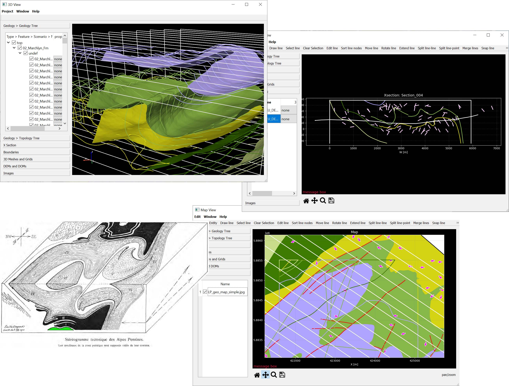

# PZero #

***PZero*** is a Python open-source 3D geological modelling application, leveraging various libraries, with a user-friendly graphical user interface allowing to perform most standard geomodelling data management and analysis tasks, explicit surface interpolation, and advanced implicit interpolation.

Up-to-date ***PZero executables*** can be downloaded for Windows, Mac, and Ubuntu in the [Releases](https://github.com/gecos-lab/PZero/releases). Mac executables are available for both ARM and Intel processors. After downloading, unzip the archive in any location you like on your disk, then run the executable. Sometimes you might be asked to autorize it. On Windows you might need to confirm the autorization in a pop-up window. On Linux you might need to allow execution with `chmod +x pzero-Linux` in the terminal. On Mac you might need to allow "Developer Mode" in Apple Menu > System Settings > Privacy & Security, and then sometimes allow execution of PZero with `chmod +x pzero-macOS-<your architecture>` in the terminal.

For your first steps with PZero, a [very simple](https://github.com/gecos-lab/PZero-test-Simple-synthetic) and a [more advanced](https://github.com/gecos-lab/PZero-test-Llyn-Padarn) test projects can be downloaded.

As discussed more in details in [this wiki page](https://github.com/gecos-lab/PZero/wiki/PZero-codebase-structure), the architecture of ***PZero*** is based on several open-source libraries. **[VTK](https://vtk.org/)** provides classes for all 3D objects, in addition to 3D visualization and basic analysis and modelling tools. The ***PZero*** graphical user interface is built with **[Qt](https://www.qt.io/qt-for-python)**. All objects in a ***PZero*** project and their metadata are collected and managed in **[Pandas](https://pandas.pydata.org/)** dataframes. We use a **[VTK-Numpy interface](https://github.com/Kitware/VTK/tree/master/Wrapping/Python/vtkmodules/numpy_interface)** that allows performing most mathematical processing with simple **[NumPy](https://numpy.org/)** syntax, while 2D plotting is performed with **[Matplotlib](https://matplotlib.org/)**. **[PyVista](https://www.pyvista.org/)** provides simplified access to **[VTK](https://vtk.org/)** visualization and I/O tools. Various 2D graphical and topological editing tools in ***PZero*** are based on **[Shapely](https://shapely.readthedocs.io)**, while **[GeoPandas](https://geopandas.org/en/stable/)**, **[Rasterio](https://rasterio.readthedocs.io)**, **[Xarray](https://xarray.pydata.org)**, **[laspy](https://github.com/laspy/laspy)**, and **[EzDxf](https://ezdxf.readthedocs.io)** provide I/O tools for GIS, point cloud, and CAD data. **[LoopStructural](https://github.com/Loop3D/LoopStructural)** provides three different implicit surface interpolation algorithms. **[mplstereonet](https://github.com/joferkington/mplstereonet)** provides stereoplots for orientation analysis.

Developers of these libraries are warmly thanked!

The ***PZero*** project started in spring 2020 thanks to a research project funded by **[Pro Iter Tunnelling & Geotechnical Department](https://www.proiter.it/)** and lead by **Andrea Bistacchi** and **Luca Soldo**. ***PZero*** is now supported by the **[Geosciences IR](https://geosciences-ir.it/)** project lead by **[ISPRA - Servizio Geologico d'Italia](https://www.isprambiente.gov.it/it/servizi/il-servizio-geologico-ditalia)** and funded by **[PNRR](https://www.mur.gov.it/it/pnrr/missione-istruzione-e-ricerca)**.

The ***PZero*** developers are (or have been):
* Andrea Bistacchi (since the beginning)
* Gloria Arienti (December 2021 - January 2023)
* Gabriele Benedetti (since January 2022)
* Tommaso Comelli (April 2023 - July 2023)
* Waqas Hussain (since November 2023)
* Riccardo Monti (since November 2023)

We acknowledge [Geode-Solutions](https://geode-solutions.com/), [Studio Vertix](https://www.vertix.it/) and [Luca Penasa](https://github.com/luca-penasa) for their contribution regarding software engineering, testing, and a more robust software development and project management in general. [Alessandro Frigeri](https://github.com/afrigeri) has provided an enthusiastic support since the beginning.

***PZero*** © 2020 by Andrea Bistacchi, released under [GNU AGPLv3 license](LICENSE.txt).

&nbsp;

   

&nbsp;
&nbsp;

The name of ***PZero*** was inspired by the zeroth element in Emile Argand's 3D model of the Pennine Alps nappe stack - possibly the first quantitative 3D geological model in the history of geological sciences (*Argand E., 1911. Les Nappes de recouvrement des Alpes pennines et leurs prolongements structuraux. Mat. Carte géol. Suisse, 31, 1-26*), and by Python.

If you want to know more about the project or want to contribute, our [Wiki](https://github.com/gecos-lab/PZero/wiki) can help!

## Installing PZero executables ##

***PZero*** runs on **Linux**, **macOS** and **Windows**. Executable files can be [downloaded from the releases section of this repository](https://github.com/gecos-lab/PZero/releases).

Alternatively, you can download the most recent source code and test it, provided that a suitable **Python** and **[required libraries](envs/std-environment.yml)** are installed as discussed in the [Wiki](https://github.com/gecos-lab/PZero/wiki).

## Test data ##

We have uploaded some test project on public repositories:

[PZero-test Simple-synthetic](https://github.com/gecos-lab/PZero-test-Simple-synthetic)

[PZero-test Llyn-Padarn](https://github.com/gecos-lab/PZero-test-Llyn-Padarn)

 
 
 

