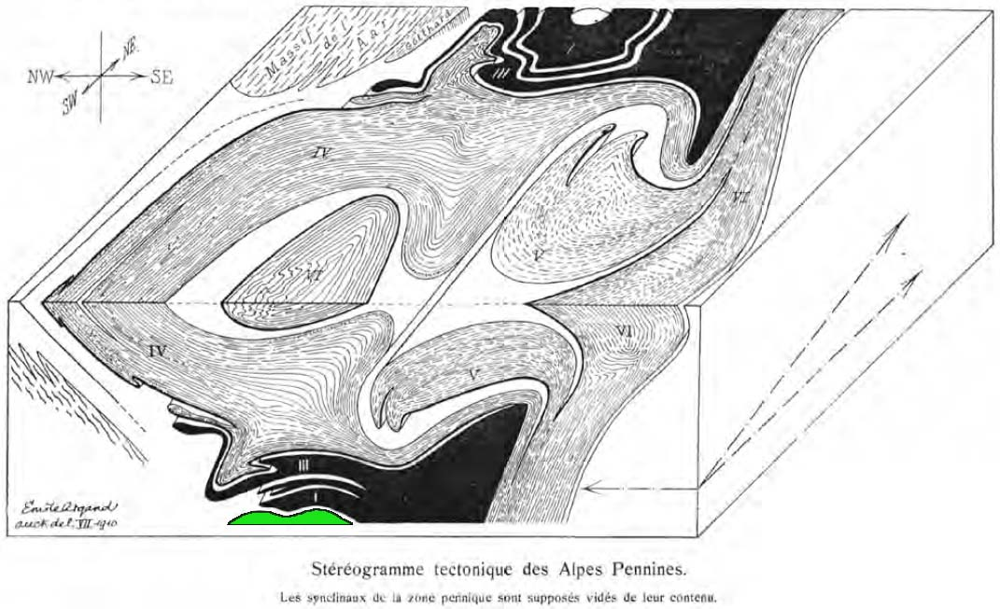

# PZero #

***PZero*** is a Python open-source 3D geological modelling application, leveraging various libraries, with a user-friendly graphical user interface allowing to perform most standard geomodelling data management and analysis tasks, explicit surface interpolation, and advanced implicit interpolation.

To build ***PZero*** we use several open-source libraries. **[VTK](https://vtk.org/)** provides classes for all 3D objects, in addition to 3D visualization and basic analysis and modelling tools. The ***PZero*** graphical user interface is built with **[Qt](https://www.qt.io/)**. All objects in a ***PZero*** project and their metadata are collected and managed in **[pandas](https://pandas.pydata.org/)** dataframes. We use a VTK-Numpy interface that allows performing most mathematical processing with simple **[NumPy](https://numpy.org/)** syntax, while 2D plotting is performed with **[Matplotlib](https://matplotlib.org/)**. **[PyVista](https://www.pyvista.org/)** and **[vedo](https://vedo.embl.es/)** provide simplified access to **[VTK](https://vtk.org/)** visualization and I/O tools. Various 2D graphical and topological editing tools in ***PZero*** are based on **[Shapely](https://shapely.readthedocs.io)**, while **[GeoPandas](https://geopandas.org/en/stable/)**, **[Rasterio](https://rasterio.readthedocs.io)**, **[Xarray](https://xarray.pydata.org)**, and **[EzDxf](https://ezdxf.readthedocs.io)** provide I/O tools for GIS and CAD data. **[LoopStructural](https://github.com/Loop3D/LoopStructural)** provides three different implicit surface interpolation algorithms.

All the developers of these libraries are warmly thanked!


The ***PZero*** project started in spring 2020 thanks to a research project funded by **Pro Iter** and lead by **Andrea Bistacchi**.

The ***PZero*** developers are:

* Andrea Bistacchi (since the beginning)
* Gloria Arienti (since December 2020)

***PZero*** © 2020 by Andrea Bistacchi, released under [GNU AGPLv3 license](LICENSE.txt).

The name of ***PZero*** was inspired by the zeroth element in Emile Argand's 3D model of the Pennine Alps nappe stack - possibly the first quantitative 3D geological model in the history of geological sciences (*Argand E., 1911. Les Nappes de recouvrement des Alpes pennines et leurs prolongements structuraux. Mat. Carte géol. Suisse, 31, 1-26*).

&nbsp;



&nbsp;
&nbsp;

# Installing and running PZero #

&nbsp;

***PZero*** runs on **Linux**, **macOS** and **Windows**, provided that a suitable **Python 3.x** and **[required libraries](requirements.txt)** are available.

At the moment the easiest way to run and develop new code for ***PZero*** is to have a suitable **[Anaconda](https://www.anaconda.com/)** environment.

In the ```conda terminal```, navigate to the ***PZero*** folder that you have cloned with **Git** or simply downloaded and import the environment with:

```
conda env create -n pzero -f environment.yml
conda activate pzero
```

Then you can start PZero with:

```
python pzero_run.py
```

You can also create the **Conda** environment manually with (in ```conda terminal```):

```
# create a clean environment called "pzero"
conda create -n pzero python=3.8
# activate it
conda activate pzero
# add conda-forge channels
conda config --add channels conda-forge
conda config --env --set channel_priority strict
# install required libraries (whith conda if available, with pip otherwise):
y
conda install -c conda-forge xarray dask netCDF4 bottleneck numpy matplotlib pandas xarray pyvista pyvistaqt vtk shapely ezdxf rasterio colorcet cmocean vedo geopandas
pip install LoopStructural
```

To periodically update the **Conda** environment use (in ```conda terminal```):

```
conda activate pzero
conda update python

conda update -c conda-forge xarray pyvista pyvistaqt shapely ezdxf rasterio colorcet cmocean geopandas loop3d loopstructural vedo
```

To save the **Conda** environment in the ```environment.yml``` file (in ```conda terminal```):

```
conda activate pzero
conda env export > environment.yml
```

In case you need to remove the pzero **Conda** environment, e.g. to build a clean new one (in ```conda terminal```):

```
conda deactivate  # (in case pzero was activated)
conda remove -n pzero --all
```

To develop ***PZero*** we use the **[PyCharm IDE](https://www.jetbrains.com/pycharm/)**, but also **[Visual Studio Code](https://code.visualstudio.com/)** has been tested successfully.
